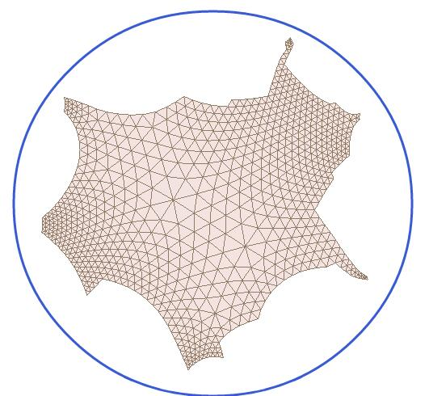
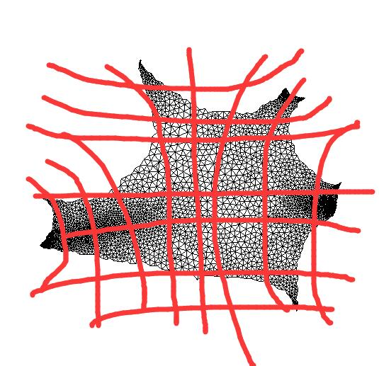

# Canonical Coordinate System for Geometry Learning
## Introduction
- It is not handy to apply CNN on graph convolution because no grid system
- This project provide such grid system on the parametrization

## Steps
### Step 1: Cut the surface and map to Poincare disk

### Step 2: Set canonical coordinate and generate geometry image
There is a X-Y coordinate for the poincare disk, so that the poincare disk can be one to one map to the euclidean coordinate
The illustrative figure is

### Step 3: Convolution along the canonical coordinates
Apply the convolution Now!

## Applications
### Surface Classification

### Surface Registration 

### Surface Generation

### Surface Transfer Learning

 